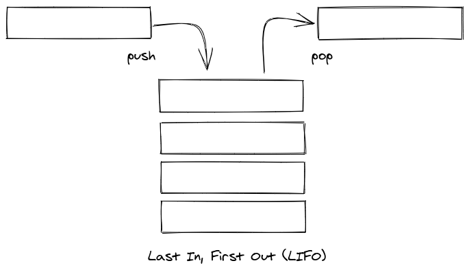

# Stacks

## Last In, First Out



## Methods

### Python

```python
# add item to stack
fooStack.append('bar')
# remove (top) item from stack
fooStack.pop()
```

### JavaScript

```javascript
// add item to stack (top)
fooStack.push("bar");
// remove (top) item from stack
fooStack.pop();
```
